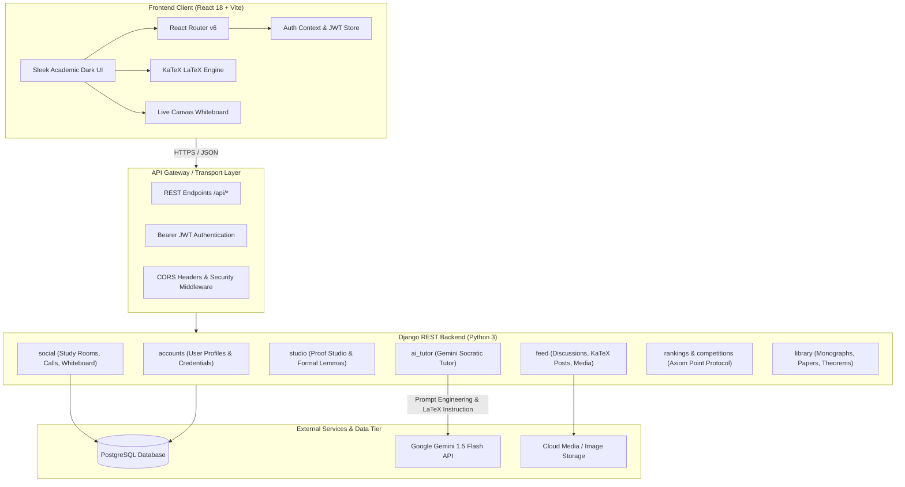

# Mathify: Academic Hub & Collaborative Mathematics Platform

A full-stack mathematical collaboration, proof authoring, and competitive problem-solving platform designed for university scholars, researchers, and STEM students. Mathify combines rigorous LaTeX mathematical typesetting, AI-assisted pedagogical tutoring, synchronous seminar video calls, shared digital whiteboards, and a verified Axiom Point competition protocol.

---

## Architecture Diagram



---

## Core Modules & Features

### 1. 💬 Academic Feed & Mathematical Discourse
- **Real-Time KaTeX Typesetting**: Native parsing and rendering of both inline (`$...$`) and display (`$$...$$`) LaTeX equations.
- **Symbol Composer Toolbar**: Quick insertion of mathematical operators ($\forall$, $\exists$, $\in$, $\notin$, $\implies$, $\iff$, $\sum$, $\int$, $\mathbb{R}$, $\mathbb{C}$, $\mathbb{Z}$, $\mathbb{N}$, $\pi$, $\infty$, $\sqrt{}$).
- **Academic Endorsements & Discussions**: Peer-reviewed theorem discussions, mathematical question threads, image attachment support, and bookmarking.

### 2. ✍️ Formal Proof Studio
- **Structured Theorem Verification**: Environment for composing formal mathematical proofs with theorem titles, lemmas, hypothesis assumptions, and Q.E.D. derivations.
- **Split-Pane Live Preview**: Simultaneous markdown and LaTeX compilation alongside raw notation input.
- **Subfield Tagging**: Classification across Pure & Applied Mathematics, Abstract Algebra, Real Analysis, Topology, Differential Geometry, and Number Theory.

### 3. 🧠 Socratic AI Tutor (Powered by Google Gemini)
- **Pedagogical Socratic Instruction**: Rigorous step-by-step guidance without handing out raw solutions, prompting scholars to discover lemmas independently.
- **LaTeX Math Output**: Enforces clean LaTeX notation for formulas and proofs.
- **Multi-Session Context**: Dynamic conversation management with persistent conversation history, session drawer, and quick mathematical inquiry chips.

### 4. 👥 Synchronous Study Rooms & Seminar Calls
- **Live Collaborative Rooms**: Peer-led rooms categorized into Study, Research, Problem Solving, and Departmental Seminars.
- **Off-Canvas Responsive Drawer**: Clean master-detail view on desktop, and a slide-out drawer on mobile for uncluttered screen space.
- **Seminar Video & Audio Calls**: Instant seminar meeting initiation with unique codes (`mtf-xxx-xxx`) and direct links for academic groups.
- **Interactive Whiteboard**: Integrated digital whiteboard for freehand derivations, geometric constructions, and mathematical sketching.

### 5. 🏆 Competitions & Axiom Point Protocol
- **Axiom Point Economy**: Strict non-inflationary academic scoring. Points are awarded **exclusively for solving and answering competition questions correctly** (+10 Axiom Points per validated answer).
- **Timed Mathematical Sprints**: Timed problem sets featuring varying difficulty tiers from foundational calculus to Olympiad-level combinatorics.
- **Institutional & Global Leaderboards**: Live scholar standings and university departmental rankings.

### 6. 📚 Curated Mathematical Library
- **Research Repository**: Centralized archive of mathematical monographs, lecture notes, formula sheets, and peer-reviewed publications.
- **Field Categorization**: Filter by discipline (Linear Algebra, Complex Analysis, Probability & Statistics, Discrete Mathematics, etc.).

---

## Project Structure

```
stitch_mathify_social_hub/
├── backend/                       # Django REST Framework Application
│   ├── accounts/                  # Custom user models, academic profiles, JWT auth
│   ├── ai_tutor/                  # Google Gemini integration, chat sessions & prompt rules
│   ├── feed/                      # Posts, KaTeX rendering, comments, image uploads
│   ├── library/                   # Mathematical papers, resources, monograph index
│   ├── mathify/                   # Core Django settings, WSGI/ASGI, root URLs
│   ├── rankings/                  # Axiom point calculations, leaderboard rankings
│   ├── social/                    # Study rooms, seminar calls, whiteboard coordination
│   ├── studio/                    # Proof Studio, theorem lemmas, proof drafts
│   ├── manage.py
│   ├── requirements.txt
│   └── vercel.json                # Vercel serverless deployment configuration
├── frontend/                      # React 18 + Vite SPA
│   ├── public/
│   ├── src/
│   │   ├── api/                   # API client, JWT interception, token refresh
│   │   ├── assets/                # Logos, SVG icons, static assets
│   │   ├── components/
│   │   │   ├── common/            # MathRenderer (KaTeX), ProtectedRoute, Modals
│   │   │   ├── layout/            # Navbar, BottomNav, responsive Layout shell
│   │   │   └── seminar/           # SeminarCallModal, WhiteboardModal, ScheduleModal
│   │   ├── context/               # AuthContext, user session & authentication state
│   │   ├── pages/                 # FeedPage, ProofStudio, Competitions, Groups, AI Tutor, Library
│   │   ├── App.jsx                # Route registry & modal portals
│   │   ├── index.css              # Dark academic design tokens & layout rules
│   │   └── main.jsx
│   ├── package.json
│   ├── vite.config.js
│   └── vercel.json                # Frontend SPA rewrites for Vercel
├── .gitignore
└── README.md
```

---

## How It Works

### 1. Authentication & Route Protection
- Uses JSON Web Tokens (`access` and `refresh` tokens) managed via `AuthContext`.
- Unauthenticated visitors have access to the Landing / Welcome overview. All internal features (Feed, Proof Studio, Groups, AI Tutor, Library, Leaderboard) are guarded by `<ProtectedRoute>` which redirects unauthorized requests to `/login`.
- Global Axios/Fetch client automatically appends `Authorization: Bearer <token>` to outbound requests and handles silent token refresh upon expiration.

### 2. Mathematical Typesetting Pipeline
- LaTeX equations wrapped in `$..$` (inline) or `$$..$$` (display mode) are parsed by `<MathRenderer>`.
- KaTeX executes client-side rendering with error boundaries, preventing malformed equations from breaking page layouts.

### 3. Synchronous Collaboration Flow
- Scholars establish or join a Study Room under `/groups`.
- The room creator or host can initiate a **Live Seminar**; participants in the room receive real-time notification cards with one-click **Join Meeting** access.
- Simultaneous derivations are conducted via the shared **Whiteboard**, allowing multi-modal academic collaboration alongside the text chat.

---

## Deploying to Vercel

The platform is designed for seamless zero-downtime deployment on Vercel as two decoupled services (Backend + Frontend) from this single repository.

### 1. Deploy the Backend (Python / Django)

1. Open [Vercel Dashboard](https://vercel.com/new) and import this repository (`Mathify`).
2. In the project setup:
   - **Project Name**: `mathify-backend` (or your preferred name)
   - **Root Directory**: Click **Edit** and choose **`backend`**
   - **Framework Preset**: **Other** (Vercel uses `backend/vercel.json` automatically)
3. Under **Environment Variables**, configure:
   - `SECRET_KEY`: A cryptographically secure random string.
   - `DEBUG`: `False`
   - `ALLOWED_HOSTS`: `*` (or your deployed Vercel domains)
   - `DATABASE_URL`: PostgreSQL connection string (Neon, Supabase, Vercel Postgres, or AWS RDS).
   - `GEMINI_API_KEY`: Google Gemini API Key (obtainable from Google AI Studio).
4. Click **Deploy**. Note your live backend URL (e.g., `https://mathify-backend.vercel.app`).

---

### 2. Deploy the Frontend (React + Vite)

1. Return to [Vercel Dashboard](https://vercel.com/new) and import the same repository again.
2. In the project setup:
   - **Project Name**: `mathify-frontend`
   - **Root Directory**: Click **Edit** and choose **`frontend`**
   - **Framework Preset**: **Vite**
   - **Build Command**: `npm run build`
   - **Output Directory**: `dist`
3. Under **Environment Variables**, add:
   - `VITE_API_URL`: The URL of your deployed backend (e.g., `https://mathify-backend.vercel.app` without trailing slash).
4. Click **Deploy**.

---

## Local Development Setup

### Prerequisites
- Python 3.10+
- Node.js 18+ and npm
- PostgreSQL (or local SQLite for development)

### 1. Backend Setup
```bash
cd backend
python -m venv venv

# Activate virtual environment
venv\Scripts\activate      # Windows (PowerShell/CMD)
# source venv/bin/activate # macOS/Linux

pip install -r requirements.txt
python manage.py migrate
python manage.py runserver
```
Backend API will be accessible at `http://127.0.0.1:8000`.

### 2. Frontend Setup
```bash
cd frontend
npm install
npm run dev
```
Frontend development server will be running at `http://localhost:5173`.

---

## Academic Ethics & Axiom Protocol

Mathify strictly enforces mathematical authenticity:
1. **No Inflationary Scoring**: Axiom Points cannot be earned by social vanity metrics (likes, comments, profile visits). They reflect strictly verified mathematical problem-solving ability.
2. **Academic Integrity in AI Tutoring**: The AI Tutor operates under Socratic constraints to assist derivation methodology rather than solving academic assignments directly.
